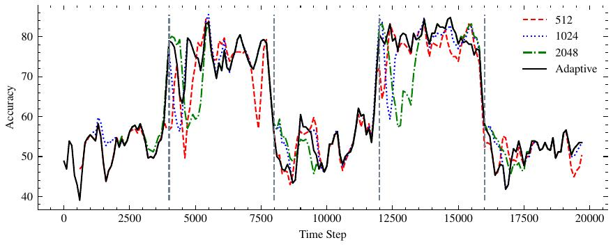

# An Adaptive Method for Weak Supervision with Drifting Data


We introduce an adaptive method with formal quality guarantees for weak supervision in a non-stationary setting. Our goal is to infer the unknown labels of a sequence of data by using weak supervision sources that provide independent noisy signals of the correct classification for each data point. This setting includes crowdsourcing and programmatic weak supervision. We focus on the non-stationary case, where the accuracy of the weak supervision sources can drift over time, e.g., because of changes in the underlying data distribution. Due to the drift, older data could provide misleading information to infer the label of the current data point. Previous work relied on a priori assumptions on the magnitude of the drift to decide how much data to use from the past. Comparatively, our algorithm does not require any assumptions on the drift, and it adapts based on the input. In particular, at each step, our algorithm guarantees an estimation of the current accuracies of the weak supervision sources over a window of past observations that minimizes a trade-off between the error due to the variance of the estimation and the error due to the drift. Experiments on synthetic and real-world labelers show that our approach indeed adapts to the drift. Unlike fixed-window-size strategies, it dynamically chooses a window size that allows it to consistently maintain good performance.





## Results

To reproduce the results, first install the required packages:

```bash
pip install matplotlib numpy pandas SciencePlots scipy seaborn tqdm
```

Then, run `python main.py` to reproduce the results reported in the paper. The results are saved in `./fig_files`.
